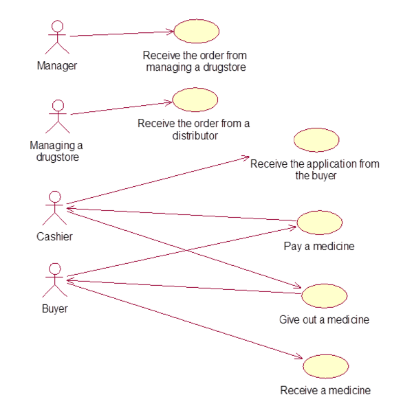

## Использовать город последнего заказа при проверке отправки подтверждения по СМС  

User Story: Я как пользователь сайта АптекиПлюс со всеми ролями хочу делать ..., чтобы ...

Use Case:

Функциональные требования:

- Установить новую версию пакета user-service-client-package + service-dto-package из задачи #3 и #5
- Используя пакет получать данные из user_data_personalisation.data.
- Заменить в методе shouldConfirmOrder регион из профиля на регион из user_data_personalisation.data::lastRegionOrderedId. Остальная логика проверки на отправку СМС останется без изменений

Критерии приемки: 

- делает то-то 
- делает это

## Системный анализ

